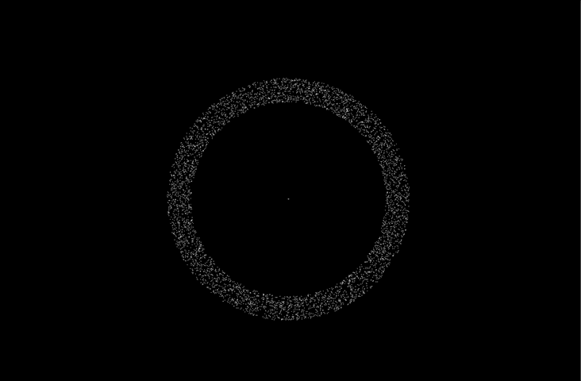

# Newton
Newton is an n body gravity simulator. Given a start state describing a system, it will continuously calculate the gravitational forces exerted with the system and update the positions of each body.

## Installation
Newton is written entirely in Rust, therefore it can be easily built via Cargo and run directly.

```
git clone https://github.com/johnxnguyen/newton.git
cd newton
cargo build
./target/debug/newton --help
```

## Usage
Newton is a command line tool which requires a single argument: the path to a yaml file describing the initial state of a simulation. This configuration file contains information about how many bodies to construct, what values their properties have (mass, position, velocity), and how they group and relate together to form systems. Consider the following example:

```YAML
# rotating-disk.yaml

gens: # This is a list of property generators.
  -
    # This generates masses between [0.1, 0.2]
    name: mass
    type: mass
    min: 0.1
    max: 0.2
  -
    # Generators have names, we will refer to these later.
    name: trans
    type: translation
    x: {min: 200.0, max: 250.0}
    y: {min: 0.0, max: 0.0}
  -
    # This generator produces the same velocity (0.0, 5.0) repeatedly.
    name: vel
    type: velocity
    dx: {min: 0.0, max: 0.0}
    dy: {min: 5.0, max: 5.0}
  -
    # This is the fourth and final type of generator.
    name: rot
    type: rotation
    min: 0.0
    max: 360.0


bodies: # This is a list of body definitions.
  -
    name: stars     # Body definitions also have names.
    num: 5000       # The number of bodies to create. Defaults to 1, if no number specified.
    m: mass         # Mass. A concrete number, or the name of a gen.
    t: trans        # Translation. A concrete value, or the name of a gen. Defaults to (0.0, 0.0).
    v: vel          # Velocity. A concrete value, or the name of a gen. Defaults to (0.0, 0.0).
    r: rot          # Rotation applied to t & v. A concrete value, or the name of a gen. Defaults to 0.0
  -
    name: black_hole
    m: 6250.0


systems: # This is a list of system definitions.
  - name: stars       # This means that there is just one system, consisting of the disk
  - name: black_hole  # called "stars" and the center called "black_hole".

```

We can then run this simulation by

```
./newton ./rotating-disk.yaml --output ./data --frames 300
```

This will run the simulation for 300 steps. For every step, a text file is produced containing the position of the bodies defined in `rotating-disk.yaml`. These files will be found in `./data`. You can then convert these text files into images (and then into a movie) using the tools of your choice. An easy way to do this is to use [Processing](https://processing.org). Here is the result.



## More Info
If you're interested in the project and would like to know more about how it works, check out the wiki for an overview of the n body problem and its solution.
